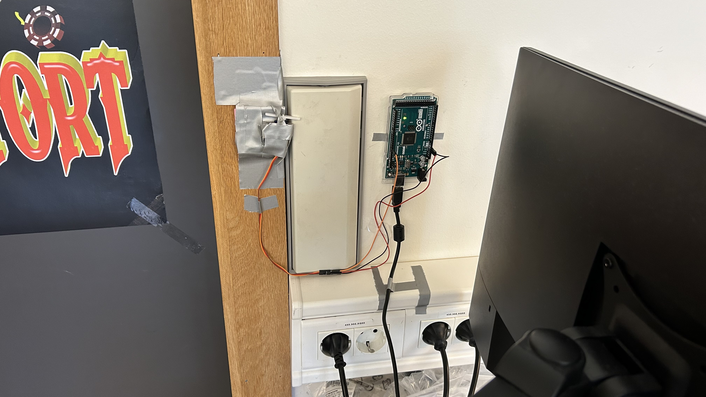
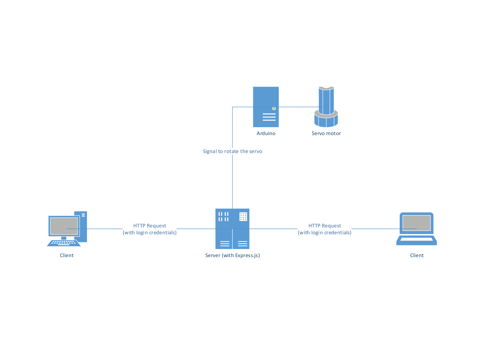

# API endpoints

## GET
### /
Default endpoint. Serves main page and logs if somoene connected
```js
app.get("/", (request, response) => { // Main page for opening
    console.log(request.session.name ? request.session.name : "Someone", "connected")
    response.sendFile(mainPage)
})
```
___
### /login
Serves login page
```js
app.get("/login", (request, response) => { // Main page for opening
    console.log(request.session.name ? request.session.name : "Someone", "connected")
    response.sendFile(mainPage)
})
```
___
### /panel
Serves admin panel
```js
app.get("/panel", (request, response) => { // Main page for opening
    console.log(request.session.name ? request.session.name : "Someone", "connected")
    response.sendFile(mainPage)
})
```
___


## POST

### /login
Serves login page
```js
app.post("/login", (request, response) => { // Login action
    DataBaseManager.login(request.body.password).then(login => {
        if (login === null) {
            response.status(404).send({
                code: 404,
                message: "User not found",
                abbr: "unf"
            });
            return
        }
        request.session.name = login.name
        response.status(200).send({
            code: 200,
            message: "User logged in",
            abbr: "uli"
        })
        return
    })
});
```
___
### /open
Serves admin panel
```js
app.post("/open", async (request, response) => { // Arduino open action
    let user
    if(request.session.name) { // If user is using browser 
        user = await DataBaseManager.findByName(request.session.name)
        console.log(request.session.name + " : is opening through website")
    } else if(request.body.password) { // If user is using external methods
        user = await DataBaseManager.login(request.body.password)
        console.log(user.name + " : is opening through POST")
    }
    else { // If neither has matching credentials
        response.status(401).send({
            code: 401,
            message: "Unauthorized",
            abbr: "UA"
        })
        return
    }
    // Then
    if (user === null) {
        response.status(404).send({
            code: 404,
            message: "User not found",
            abbr: "unf"
        });
        return
    } else if(!user.enabled) {
        response.status(401).send({
            code: 401,
            message: "User disabled",
            abbr: "ud"
        })
        return
    }
    

    arduino.openDoor() // There are responses on this. Might want to do something with that
    response.status(200).send({
        code: 200,
        message: "Door opening",
        abbr: "do"
    })
    return
})
```

## ALL
Gives 404 then redirects to /
```js
app.all("*", (request, response) => { // THIS HANDLES USER ATTEMPTING TO ACCESS UNKNOWN PAGES
    response.status(404).redirect("/")
    console.log("Unknown request:"
        + `\n\tip:\t\t${request.ip}`
        + `\n\turl:\t\t${request.url}`
        + `\n\tmethod:\t\t${request.method}`
    );
});
```

# Hooks
### Users.afterUpdate
Sends update through websocket to UI for all admins logged into /panel when any user is updated
```js
Users.addHook("afterUpdate", (instance) => {
    const updatedData = instance.get();
    wss.clients.forEach(client => {
        client.send(JSON.stringify({action:"updateEnabled", student: {name: updatedData.name, isEnabled:updatedData.enabled}}))
    })
}) 
```

# Middleware
```js
app.use(session({
    store: DataBaseManager.store(),
    secret: "our-secret",
    resave: false,
    saveUninitialized: false,
    cookie: {}
}))
app.use(cors());
app.use(express.json());
app.use(express.static("frontend", {extensions:["html", "js", "css"]})) // Publicly accessable through path. Allows serving files without sendFile on every file
app.use(isLoggedIn)
app.use("/panel", [ ensureAuthenticated, express.static("admin", {extensions:["html", "js", "css"]} ) ] )// On this path check if user is admin
// If above works, should only be accessible by those with admin

// Redirects user
function isLoggedIn(req, res, next) { 
    if(req.url == "/login" && req.session.name) { // If logged in and trying to access /login
        res.redirect("/")
    }
    if(req.session.name == undefined && (req.url !== "/login")) { // If not logged in and trying to access any other page
        res.redirect("/login")
    }
    next()
}

function ensureAuthenticated(req, res, next) {
    DataBaseManager.findByName(req.session.name).then(user => {
        console.log(user.isAdmin)
        if(!user.isAdmin){
            console.log("is not admin")
            res.redirect("/")
        } 
        next()
        
    })
}
```

